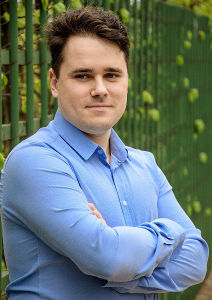

= CV
:notitle:
:author: Igor Botian
:doctype: article

== Igor Botian

[frame=none]
[grid=none]
[width=100%]
[cols="22%,32%,45%"]
|===
| *Position* | Java developer .6+^.^| 
| *Citizenship* | Russian Federation
| *City* | Saint Petersburg
| *Phone number* | +7 (967) 511-19-64
| *E-mail* | mailto:igor.botian@gmail.com[igor.botian@gmail.com]
| *GitHub* | https://www.github.com/igorbotian[@igorbotian]
|===

=== Technologies

_Core Java_, _Maven_, _Linux_

=== Work experience

==== 2012 - present, Alcatel-Lucent Enterprise

Currently, I work on a communication software system (b2b).
Our customers are airports, banks, hotels, public agencies, etc.
The project development is international, English is used as a working language.
Project codebase is about 20 millions lines of code.
My team is responsible for low level backend components (approx. 1.5 millions lines of code).

Used technologies are Java SE, Maven, PostgreSQL, RabbitMQ, OpenSUSE, Git, Jenkins.

I'm responsible for technical decisions in my team.
I've a great experience in legacy code support.
Several sessions of global refactorings were successfully conducted by me.
It made it possible to solve some fundamental issues revealed in the project.
Dozens of major and critical bugs on customers' installations were fixed by me.

A project migration tool was solely implemented by me.
It made the company possible to sign new contracts with the customers using an unsupported software.
I play a leadership role in upgrading our tech stack (Java 6-7-8, Maven 2-3, Mercurial-Git, JUnit 4-5, Log4J 1-2, etc.).
I was responsible in moving from Oracle JDK to AZUL Zulu and took part in technical negotiations with the AZUL company.
Also, I am a contact person so far.

Series of successful optimizations were performed by me.
Functional tests execution time was reduced 8 times (from 40 min to 5 min), end-to-end tests now execute 3 times faster (from 1h 40 min to 30 min), component's bundle size was reduced from 62MB to 35MB.
Multiple project auxiliary tools were developed by me.
They main aim is to automate development process as much as possible.
I evolved and optimized our CI processes too.
Regular automatic static code analysis was introduced by me (Sonar, JaCoCo, FindBugs, error-prone compiler, jhades).

Dozens of technical sessions were conducted by me in the office.
I played a role of Scrum master, got a http://bcert.me/szowjwtj[certificate], made multiple improvements to our development process.
Also, I initiated a move from Eclipse to IntelliJ IDEA as well as obtained Safari Books Online and PluralSight corporate subscriptions.
I've been using Linux for years.
Finally, I have a prolonged remote working experience.

==== 2009 - 2012, Radar MMS

Took part in modeling of the targeting system of intercontinental ballistic missiles (NDA).
Used technologies were Java SE, Swing, JUnit.
Worked remotely.

==== 2008 - 2010, NIC SPb ETU

Supported an electronic declaration system (customer is the Federal Customs Service).
Took part in development of a satellite data processing and storage system (customer is the Ministry of Defense) (NDA).
Designed and implemented a satellite trajectory construction system (customer is the Federal Space Agency).
Used technologies were Java SE, JSP, GWT, Swing, C++, Qt.

=== Education

[frame=none]
[grid=none]
[cols="15%,85%"]
|===
| *2010-2012* | Lappeenranta University of Technology,
| | _M. Sc. (Technology), Communication software_
| *2005-2011* | SPb Electrotechnical University "LETI"
| | _M. Sc. in Applied Mathematics and Informatics_
|===

=== Languages

English (upper intermediate), Finnish (basic).

=== Publications

[frame=none]
[grid=none]
[width=100%]
[cols="20%,80%"]
|===
| *In English* | I. Botian, "Software security vulnerabilities in mobile peer-to-peer environment", ISBN 978-3-659-11253-9 (https://github.com/igorbotian/msc-thesis/releases[link])
| *In Russian* | 6 publications in the area of Machine Learning (SVM) (https://github.com/igorbotian/phd-articles/releases[link])
|===
